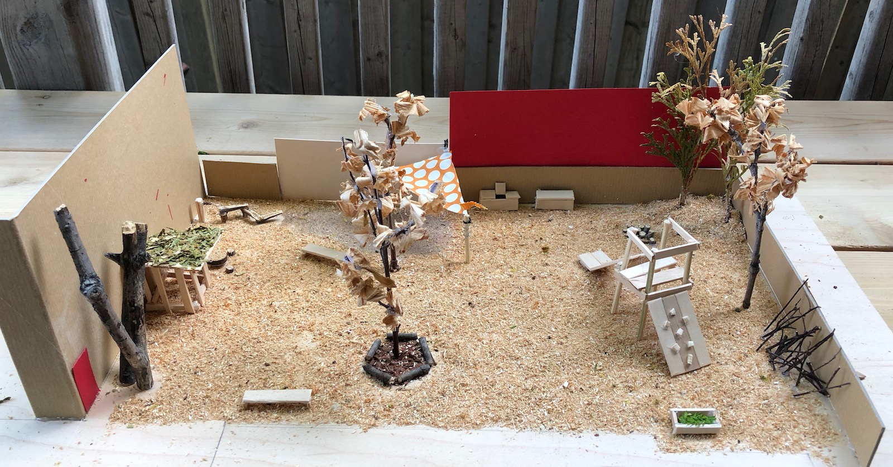
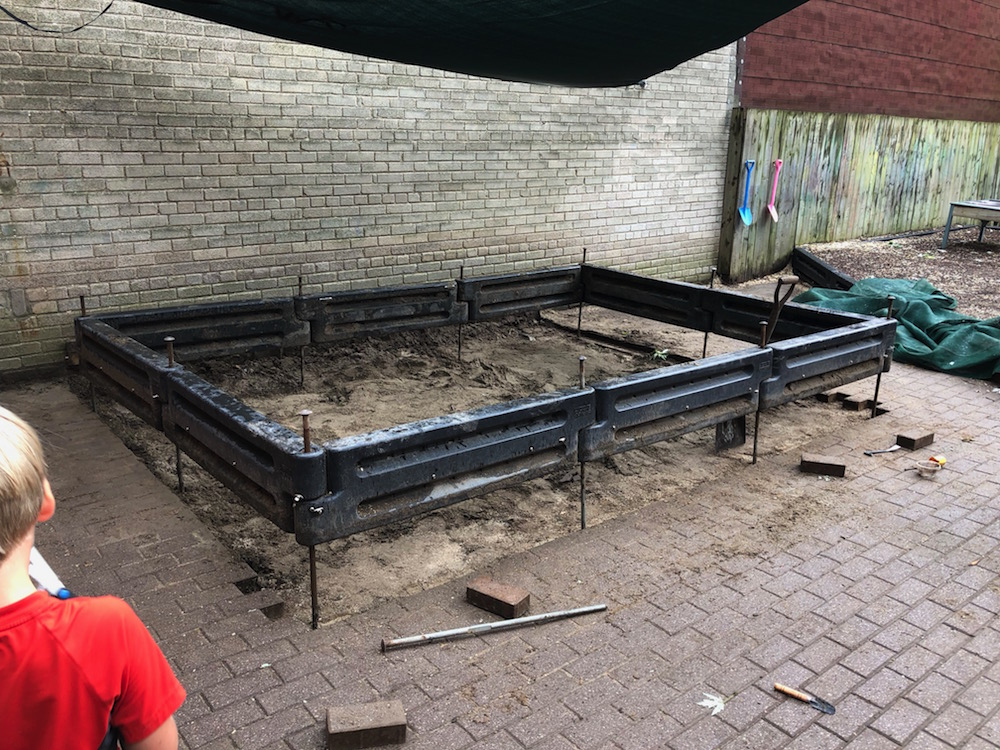
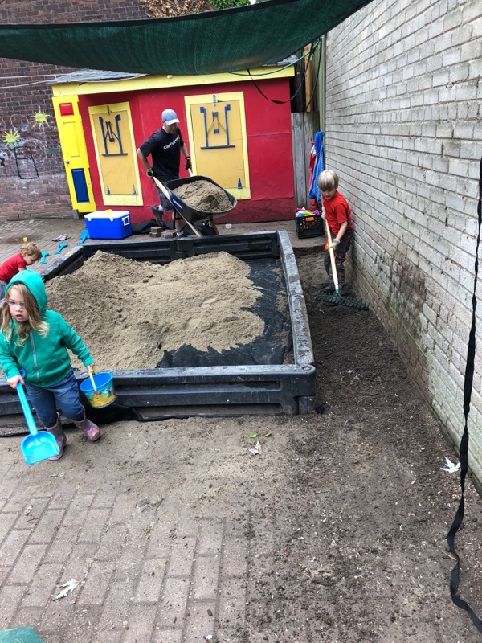
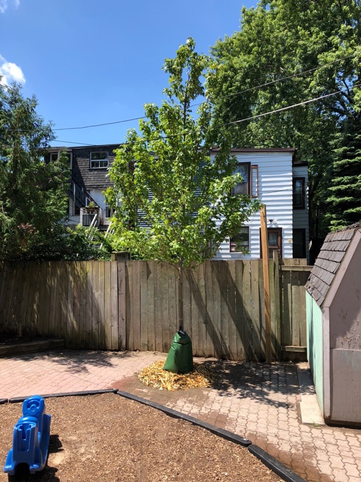
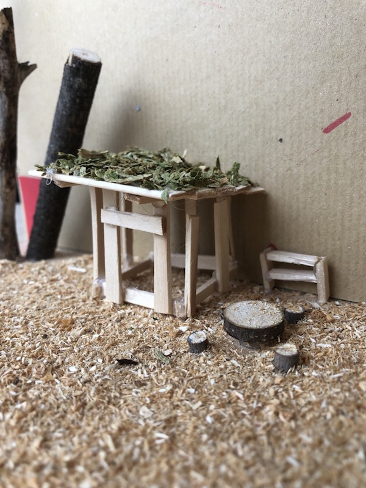

# MATTHEW-JOHN PLAYGROUND

## WHAT IS THIS?
This page is a collection/archive/brain-dump of information relating to the playground at the Matthew John Playground Centre. (If anyone stumbles across this that isn't aware, MJDCC is a parent-run daycare in Toronto, Canada.)

## BACKGROUND
A new playground committee was formed after the 2017 AGM. The goal was to refresh the existing playground which was over 20 years old. The playground also lacked shade as a mature tree in the yard to the west of the playground was removed.

## ACTIVITY (2017-2018)

### STAFF WORKSHOP

- gather feedback from staff about what works with the current playground and what could be improved

[workshop reflections](./playground-workshop-reflections.md)

### BOARD PRESENTATION
15 Feb 2018

Presentation to the board including the results of the staff workshop, and next steps.

[Playground Update](./playground-update-20180215.pdf)

### SHORT-TERM IMPROVMENTS
29 Apr 2018

After we were quoted over $140k for a playground build, we decided to step back and look for some inexpensive improvements.

[Short-term Playground Improvments PDF](./mjdcc-playground-improvements-20180429)

### PLAYGROUND VISION

31 May 2018

Presented a vision for the future playground at the annual Spring Mingler.

[model](./model-front-1600.jpg)

> The reimagined outdoor
> play space at Matthew
> John takes its cues from
> natural playgrounds and
> open space: keeping it
> simple.

> A space to create, to plant,
> to move water around, to
> climb and fall and laugh.
> A space for all seasons.
> Low maintenance and
> equally suited to students
> and teachers, babies and
> toddlers.

> We envision rustic materials grouped in various play zones,
> with ample circulation space in between. Pavers get
> replaced by wood chips, shade comes by way of mature
> trees, with simple play structures dotting the landscape.

### PARENT WORK EVENT 1
17 Jun 2018

An intensive cleanup of the playground (e.g. removed excess dirt/sand/dust, removed broken items from the storage shed) and installed a 6x6 post for a shade sail over the sandbox.

### PARENT WORK EVENT 2
23-24 Jun 2018

Removed old sand, moved the sandbox away from the wall, and replaced the sand with high-quality granite sand.

### New Tree
28 Jun 2018

An Autumn Blaze Maple (80mm ø) was planted on the west side of the playground to provide shade, introduce more natural elements into the playground.

The tree was planted by Upanoak Tree Care and has a 2-year warranty.

A 100' hose was purchased to help with watering the tree, and a watering schedule was posted. The tree needs to be watered twice a week for the first season and then once a week in 2019.

## Meeting Minutes

- [2017-11-15](./playground-20171115.md)
- [2017-12-07](./playground-20171207.md)
- [2018-03-13](./playground-20180313.md)

## Next Projects?

### Playhouse
 - small house (with green roof)
 - windows with wide window sill for a work area
 - wood: cedar 2x4, non-toxic, naturally rot-resistant

### Nature area

- create soft landscaping area by remove stones in west end of playground
- add playground-certified fibre mulch (15-20cm)
- fibre mulch mats with use to create a soft "carpet"

### Planters
 - built with cedar 4x4's or a half-barrel planter
 - many plant options: flowers (for butterflies), bamboo, vegetables

### Rain barrel
 - goes well with planters
 - rain barrel could use the downspout from the rectory
 - barrel needs to have a filter at the top to prevent insects
 - barrel needs to be attached to the building to prevent it from tipping over

### Benches
- reuse the logs from the felled tree branch
- Logs can be sawed flat, or left as-is with bark
  - all sharp edges sanded down with a belt sander
  - logs need to be secured to prevent rolling
  - log can be notched on both sides and a split log (or 4x4) can be placed in a notch and screwed in

### Demolition of existing playstructure
- two quotes for the demo were around $2,000
- demo is relatively straightforward, but the real issue is: What to build after?
- there are many rules/proesses around fixed playground equipment. For example: The ministry of education needs to be informed of any changes.

> Submit an email request which includes the following: 
>
> -       Nature and scope of the work (what changes will be made)
> -       Anticipated start and end date
> -       Playground plans which include unobstructed measurement, fence height, location of gates and whether or not there will be fixed equipment
> -       Action plan regarding how the minimum of two hours of outdoor time requirement will be met for each child enrolled where the playground will not be available for use during the renovation
> -       Where changes/alterations will be made to fixed structures and/or new fixed structures will be added, a third party inspection will be required to be submitted to the Ministry prior to children’s use
> 
> Once the following is submitted I will request a Playground Minor Alteration/renovation Approval Letter for your records. 
> Source: Program Advisor from Ministry of Education

## Suppliers

### Highland Gym
- TODO: frank?
- has been hired to make repairs to existing Henderson playstructure
- can build conventional, wooden playstructures
- quoted for demo (and disposal) of existing playstructure: $2,000

### [Upanoak Tree Care](http://upanoak.ca)
- Contact: Darryl
- 647-222-1737

### [Parkview Building Supply](http://parkviewonline.ca)
- 416-752-4748
- used for removing old sand/dirt and woodchips
- 14 cubic yard bin (for clean fill): $519.80

### [Hutcheson Sand and Gravel](http://www.hutchensonsand.com)
- high-quality granite csa-compliant playsand
- sales rep: Eugene eugenet@hutchesonsand.com
- purchased 5 imperial tons of sand ($90/ton)

### [Henderson Recreation Equipment](http://hendersonplay.com/)
- manufacturer of large play structure (model 1224, order 677090, install date: July 1999)
- still in business and are able to supply parts for old models

### Gro-Bark
- play mulch, playground approved woodchips
- Sales rep: Jackson 905-691-8265
- Mulch pricing:
  - classic cedar $36/cubic yard
  - fibre top $32.75/cubic yard
  - Delivery: $230
  - minimum order 20 cubic yards

### GB Stone
- reseller of Gro-Bark with no minimum order
- play mulch, woodchips
- (905) 846-2662
- fibre top: $47.50/cubic yard
- Delivery: $195

